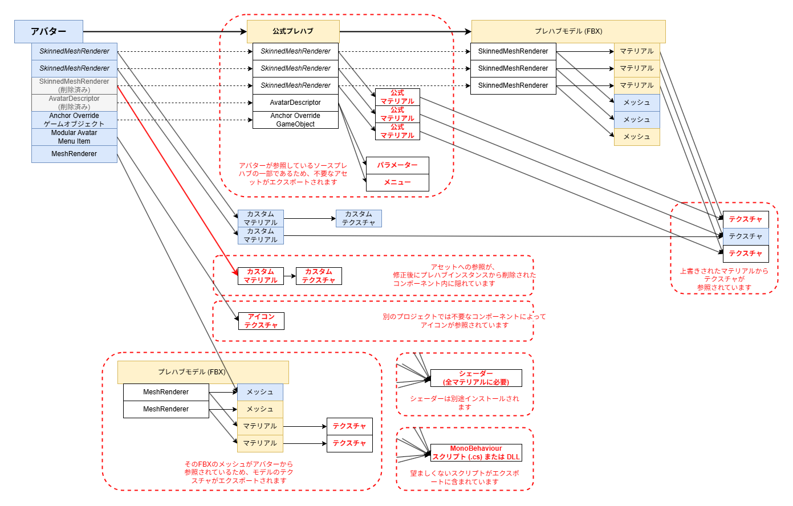
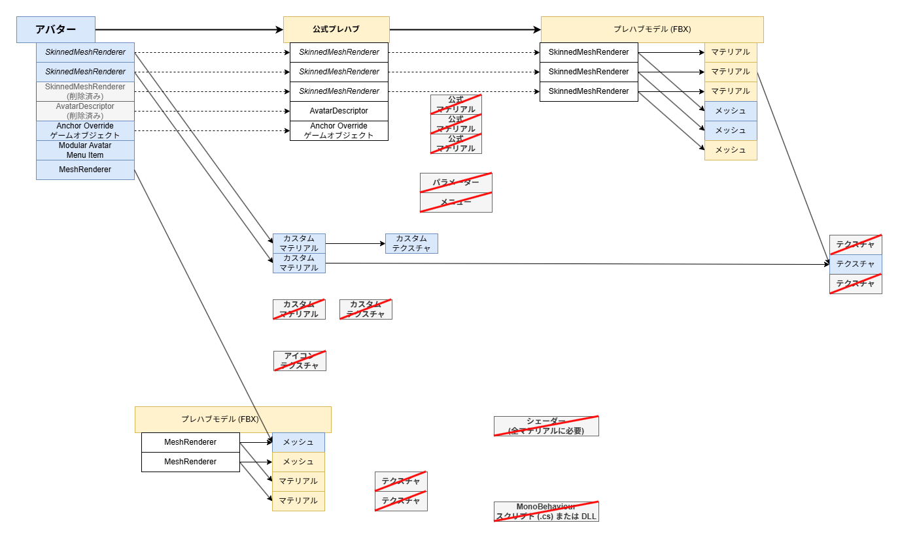

---
unlisted: true
date: 2026-07-13T13:50
---
import HaiLocalization from "/src/components/HaiLocalization";

2026-07-13 なぜ Export .unitypackage 機能はこれほど多くのアセットを含んでしまうのか？
=====

<HaiLocalization languages={['en', 'ja']} />

Unityのデフォルトの「Export .unitypackage」機能を使用してアセットをプロジェクト間で転送する際、カスタムアバターなどではアセットが複数のフォルダに散らばっていることがよくあります。しかし、エクスポートの内容には、カスタムアバターには特に必要のない余計なアセットが含まれてしまうことがよくあります。その理由は以下の通りです：

- アクティブなヒエラルキー内に意図せず不要な参照が残るのを防ぎたいため：
    - プレハブインスタンスには、使用されていないアセットへのゴースト参照が含まれている場合があります。
    - コンポーネントに、モデルのサブアセットやプレハブ内のトランスフォームへの迷い込んだ参照が含まれていることがあり、それがソースプレハブのすべてのアセットを引き込んでしまうことがあります。
- 互換性のないコンポーネントによって参照されるアセットを含めたくないため：
    - 一部のコンポーネント（例：*Modular Avatar Menu Item*）は別のプロジェクトでは無関係な場合があり、アイコンテクスチャなどのアセットへの参照を含んでいます。
    - 一部の独自アセット（例：*Expression Menu*）は別のプロジェクトで互換性がない場合があり、それらのアセット自体が他のアセットへの参照を含んでいることがあります。
    - 一部のUnityアセット（例：*Animator Controller*、*Animation Clip*）は別のプロジェクトでは無関係な場合があります。
- 一般的なアセットを別途インストールしているため：
    - シェーダー、スクリプト、DLLなどは、通常ユーザーが別途インストールするため、含めるのが望ましくないことが多いです。
- アセットを置き換えた、またはアクティブなヒエラルキーからオブジェクトを削除したため：
    - プレハブのオリジナルバージョンには、プレハブインスタンスで使用していないアセット（マテリアルなど）への望ましくない参照が含まれている場合があります。
        - 例えば、購入したアバターの元のプレハブには望ましくないマテリアルが含まれていることがありますが、すでに自分のものに置き換えている場合です。
        - あるいは、他のアセットへの参照を含んでいたコンポーネントやゲームオブジェクトをプレハブから削除した場合です。
    - 場合によっては、一部のオブジェクトに興味がないことを示すために意図的に *EditorOnly* タグを使用していることがあり、それらの *EditorOnly* オブジェクトによって参照されるマテリアルやテクスチャは必要ない場合があります。
      デフォルトでは引き続き *EditorOnly* としてマークされたオブジェクトからアセットをエクスポートしますが、そのようなオブジェクトによって参照されるアセットも除外することで、より積極的なカリングを行う選択肢もあります。
        - このツールはシーンやプレハブを変更しないため、ゲームオブジェクトとコンポーネントはヒエラルキーに残り続け、アセットのみが除外されます。
        - プレハブインスタンスが EditorOnly としてマークされている場合でも、インポート時のエラーを防ぐために、対応するプレハブソースは引き続きエクスポートします。

以前の様子：

その後の様子：

