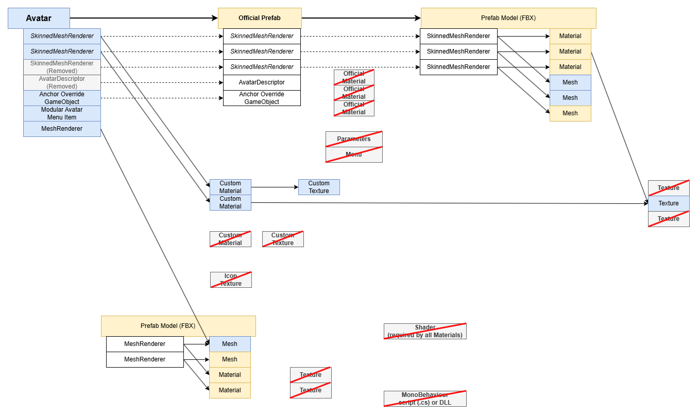

import HaiLocalization from "/src/components/HaiLocalization";

2026-07-13 What causes the Export .unitypackage function to include so many assets?
=====

<HaiLocalization languages={['en', 'ja']} />

When exporting a custom avatar using Unity's default *Export .unitypackage* function to transfer assets between projects,
assets are often scattered across multiple folders as expected from a custom avatar.

However, the contents of the export often end up with extra assets that aren't particularly needed by the custom avatar.

All of these reasons can be summarized using the picture below, but the first reason listed here can be very unexpected.
I suggest you read the first reason in detail, and skim over the others since many of them are predictable once you're aware of it.

### A prefab instance simultaneously overrides a field and deletes the component that contains that field

If a prefab instance overrides an asset reference on a component, and that prefab instance simultaneously removes the same component or GameObject which is present in the prefab,
the override referencing the asset continues to exist.

In addition, the Unity Editor prefab override UI is incorrect and will not display overriden references inside removed components.
The act of un-removing the component will expose the hidden reference that it contained.

Detecting this issue is nearly impossible without external tooling.

### A reference inside the active hierarchy points to a Transform located within a prefab source that you do not use

Components may contain stray references to sub-assets of a model or a transform within a prefab, even if you are not using that prefab source on your avatar.

This is a problem because it means every reference used by that prefab source will be required, along with any other asset referenced by them.

On my projects, I've found that the anchor override of a SkinnedMeshRenderer sometimes points to a transform located inside a prefab source.

### A reference points to a sub-asset of a prefab model

If a sub-asset of a prefab source or model is required (such as Mesh), then the entire prefab source is required.

This is a problem because of the next reason.

### A prefab model (FBX) contains references to textures that you do not use

Sometimes, textures located inside the project are referenced directly by the prefab model (FBX).

Even if you do not use the texture in any of your active materials, it might get included.

### A prefab source requires assets that you have overriden

A prefab source may be set up with asset references pointing by default to assets that you are not using because they are overriden by your prefab instance or prefab variant.

This is typically true when you are using avatars that you have purchased, but you have overriden some materials.

In turn, these assets may reference other assets, such as texture, that you may also not be using.

### A prefab source requires assets in a Component or GameObject that you have removed

Very similar to the previous reason, but instead of overriding the asset with another asset, you have removed the component or GameObject altogether.

### A prefab instance or a prefab source requires assets in GameObject which is EditorOnly

As an alternative to removing a Component or GameObject, it can be common practice to set it to EditorOnly so that you can preserve the objects, so that you may re-include them later.

Not only the prefab source may reference assets that you are not using; it is possible that you are yourself overriding some fields using assets on the prefab instance,
which will not end up being used.

It is ambiguous as different people will use EditorOnly differently in their workflow, but it is worth a mention.

### A component or material requires a script, and references inside those scripts

- Materials require a shader. Shaders are often installed separately.
  - Shaders sometimes contain references to default textures in them. Those textures are often installed with the shader itself.
- If a GameObject references a MonoBehaviour, it may require scripts, and DLLs. Those are often installed separately.
  - If a MonoBehaviour uses an icon, then that icon can end up being included.

### If you are exporting to another game, some references inside components may be undesirable

If you are exporting from one game to another game, some references inside components can be irrelevant.

- Some components may be irrelevant in another project (e.g. *Modular Avatar Menu Item*) and contain references to assets such as icon Textures.
- Some proprietary assets may be incompatible in another project (e.g. *Expression Menu*), and those assets may themselves contain references to other assets.
- Some Unity assets may be irrelevant in another project (e.g. *Animator Controller*, *Animation Clip*).

### Before and after

How it looks like before (this is the same picture as the one at the top of this article):

And after:

